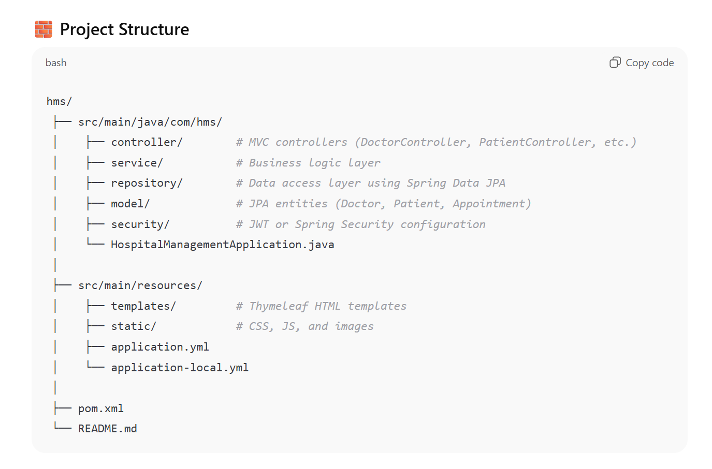
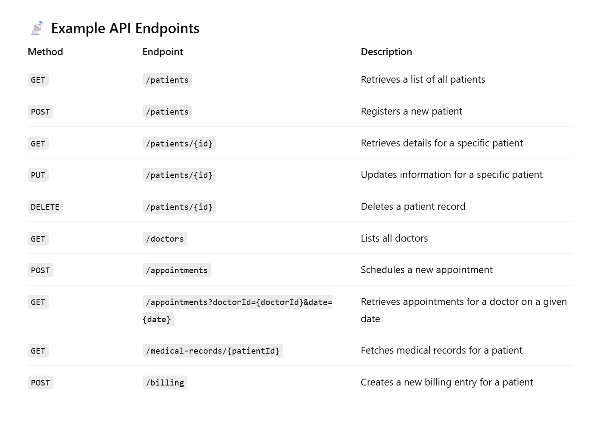

# 🏥 Hospital Management System (Spring Boot + MVC)

## 📖 Overview
The **Hospital Management System (HMS)** is a **Spring Boot–based web application** built using the **Spring MVC architecture**.  
It provides interfaces for **Admins**, **Doctors**, and **Patients** to manage hospital operations such as appointments, doctor schedules, and patient records — all within a single, server-rendered application.

This version uses **Spring Boot**, **Spring MVC**, **Spring Security**, and **Spring Data JPA**, backed by **MySQL** or **MongoDB** databases.

---

## ⚙️ Tech Stack

### 🧩 Backend
- **Java 21**
- **Spring Boot 3**
- **Spring MVC** for controllers and server-rendered views
- **Vanilla JavaScript** for client-side interactivity
- **Spring Data JPA + Hibernate** for ORM and persistence
- **Spring Security** with JWT or session-based authentication
- **Thymeleaf (or JSP)** for rendering HTML templates
- **Maven** for dependency management and build
- **Profiles** for local and remote (Docker) environments

## ⚙️ Deployment
 Deployed to AWS using ECS, EC2, ALB, RDS, and MongoDB Atlas. The application load balancer directs traffic to both this Spring app and an angular ssr app. 

### 🗄️ Database
- **MySQL / MongoDB**
- JPA entity mappings for `Doctor`, `Patient`, and `Appointment`
- Schema auto-generated on startup via
  ```properties
  spring.jpa.hibernate.ddl-auto=update



## 🔐 Authentication & Authorization

Spring Security handles **login**, **logout**, and **route protection**.

### 👥 Role-based Permissions

| Role | Permissions |
|------|--------------|
| **Admin** | Manage doctors, patients, and appointments |
| **Doctor** | View assigned patients and appointments |
| **Patient** | Book and view personal appointments |

Supports **JWT tokens** or **session-based login**, depending on configuration.

---

## 🧠 Key Features

- ✅ Add, update, or delete doctors and patients
- ✅ Schedule and view appointments
- ✅ Secure login and registration for all roles
- ✅ Server-rendered pages using Thymeleaf templates
- ✅ Database integration via Spring Data JPA
- ✅ Environment-based configuration (local vs remote)




🌱 Future Enhancements
Migrate from Spring MVC to an Angular frontend