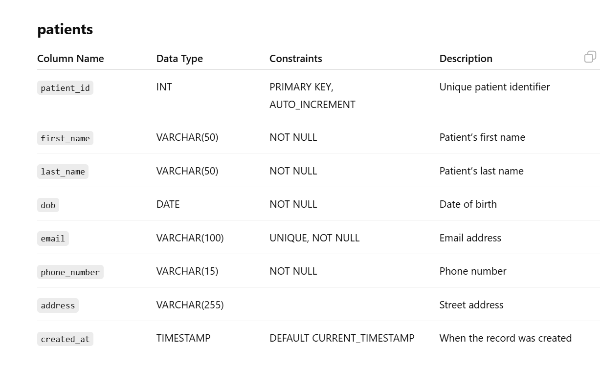
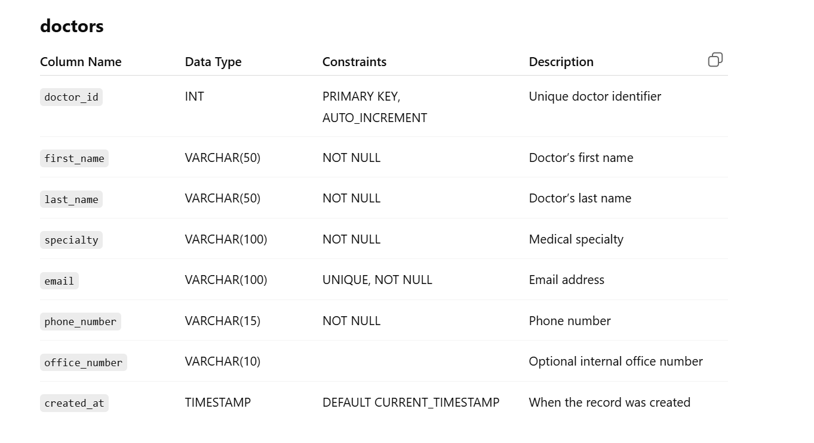
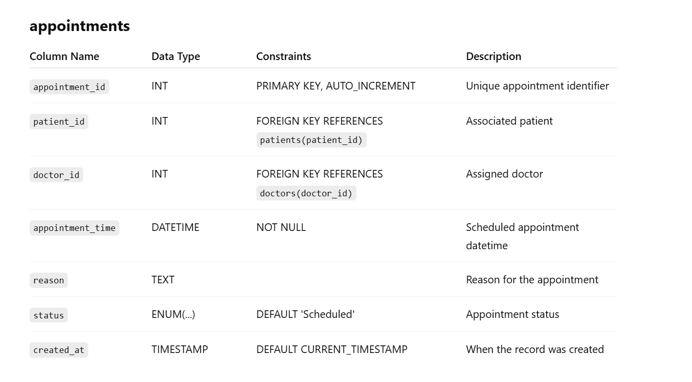
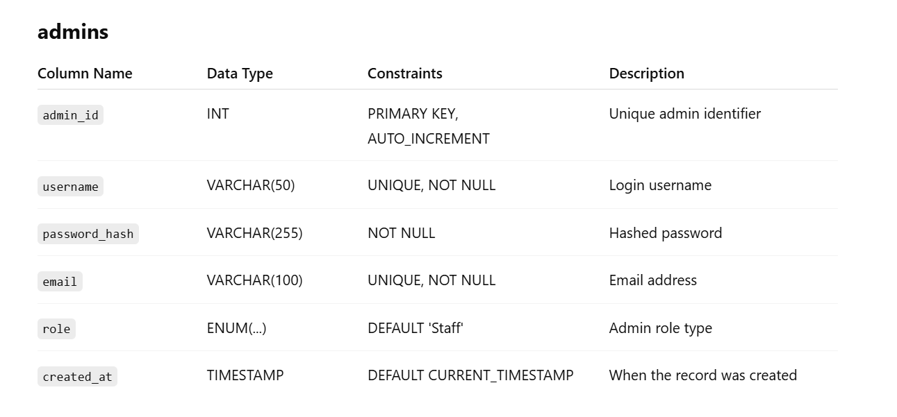

## MySQL Database Design 
## Smart Clinic Management System
 ## Tables 
patients

doctors

appointments

admins

## MongoDB Collection Design

## Prescriptions schema 

{
"_id": ObjectId("665f2b9c9b3f2a6fc4123456"),
"prescription_id": "rx_2025_0007",
"patient_id": 101,
"doctor_id": 204,
"appointment_id": 5001,
"issued_at": "2025-06-30T09:45:00Z",
"medications": [
{
"drug_name": "Amoxicillin",
"dosage": "500mg",
"frequency": "3 times a day",
"duration_days": 10,
"instructions": "Take with food. Avoid alcohol.",
"tags": ["antibiotic", "infection"]
},
{
"drug_name": "Ibuprofen",
"dosage": "200mg",
"frequency": "as needed",
"max_per_day": 4,
"instructions": "Take after meals if stomach is upset.",
"tags": ["pain", "inflammation"]
}
],
"notes": "Patient has no known drug allergies. Monitor GI side effects.",
"refill_info": {
"refills_allowed": 2,
"refills_remaining": 1,
"last_refill_date": "2025-06-25"
},
"pharmacy": {
"name": "HealthFirst Pharmacy",
"location": "123 Main St, Charlotte, NC",
"contact": "(704) 555-0199"
},
"meta": {
"platform": "web_portal",
"signed_by": "Dr. Emily Smith",
"is_e_prescription": true
}
}
## Design Notes:
medications is an array of embedded documents, ideal for multi-drug prescriptions.

patient_id, doctor_id, and appointment_id can be cross-referenced with relational tables.

refill_info supports tracking usage and limits.

tags help categorize medications for analytics or alerts.

pharmacy and meta fields allow flexibility in tracking fulfillment and platform context.